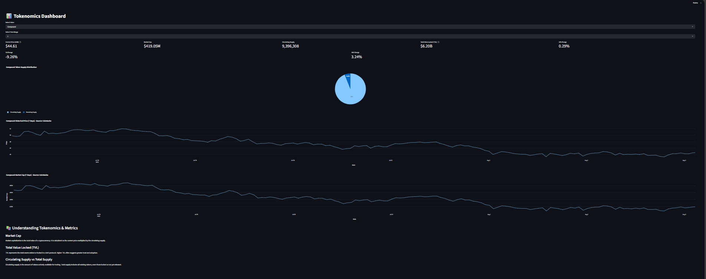

# 🦄 Tokenomics Dashboard

A robust, professional Streamlit dashboard for analyzing tokenomics and DeFi metrics of major crypto protocols.  
Built for reliability, with automatic API fallback and best-in-class error handling — inspired by S&P Global–style quant dashboards.

---

![Dashboard Screenshot] 

---

## 🚀 Features

- **Live price, market cap, and supply** for AAVE, Uniswap (UNI), and Compound (COMP)
- **Real-time TVL (Total Value Locked)** from DeFiLlama
- **Historical price charts** — always display with automatic fallback (CoinGecko → DeFiLlama → Binance)
- **Token supply pie chart** (displays only when supply data is available)
- **Graceful handling of missing data:** clear warnings for users, never a broken chart or crash
- **Visual indicators for all data sources**
- **Easy to extend for more tokens or metrics**

---

## 🛠️ Setup Instructions

### 1. Clone the Repository

```bash
git clone https://github.com/yourusername/tokenomics-dashboard.git
cd tokenomics-dashboard


[def]: Screenshot.png.png